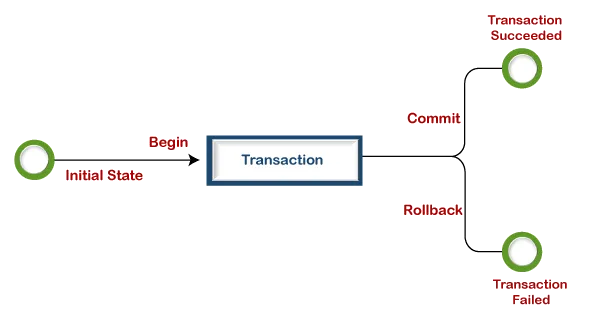

# Database Transactions

- The purpose of a transaction is to ensure that all the database operations within that transaction are treated as a single, atomic operation. This means that either all the operations within the transaction are completed successfully, or none of them are. If an error occurs during the transaction, all the changes made up to that point will be rolled back, meaning that the database will be restored to its previous state.

