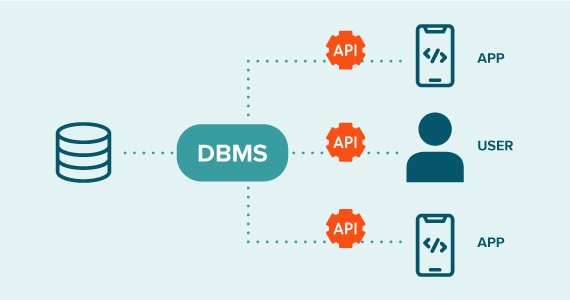

# What Is a Database?

## Database defined

- A database is an organized collection of structured information, or data, typically stored electronically in a computer system. A database is usually controlled by a `database management system (DBMS)`.

---

## What is Structured Query Language (SQL)?

- SQL is a programming language used by nearly all relational databases to query, manipulate, and define data, and to provide access control.

---

## What’s the difference between a database and a spreadsheet?

- Spreadsheets were originally designed for one user, and their characteristics reflect that. They’re great for a single user or small number of users who don’t need to do a lot of incredibly complicated data manipulation. Databases, on the other hand, are designed to hold much larger collections of organized information—massive amounts, sometimes. Databases allow multiple users at the same time to quickly and securely access and query the data using highly complex logic and language.

---

## Types of databases

- Relational databases
- Object-oriented databases
- Distributed databases
- Data warehouses
- NoSQL databases
- Graph databases
- Open source databases
- Cloud databases
- Multimodel database
- Document/JSON database
- Self-driving databases

---

## What is a database management system (DBMS)?

- A database typically requires a comprehensive database software program known as a database management system (DBMS). A DBMS serves as an interface between the database and its end users or programs, allowing users to retrieve, update, and manage how the information is organized and optimized. A DBMS also facilitates oversight and control of databases, enabling a variety of administrative operations such as performance monitoring, tuning, and backup and recovery.
- Some examples of popular database software or DBMSs include MySQL, Microsoft Access, Microsoft SQL Server, FileMaker Pro, Oracle Database, and dBASE.

### What are the key features of a database management system?

- Data storage
- Data retrieval and manipulation
- Data integrity and concurrency control
- Security
- Backup and recovery
- Consistency
- Indexing

### What is an example of a database management system?

- MySQL
- Oracle Database: Oracle’s database is famous for its scalability, robustness, and enterprise features suitable for large and mission-critical applications.
- MongoDB: MongoDB is a popular NoSQL database that uses a document-oriented data model. It is designed for flexibility, scalability, and handling of unstructured data. MongoDB is widely used in web and mobile applications.

---

## What is a MySQL database?

- MySQL is an open source relational database management system based on SQL. It was designed and optimized for web applications and can run on any platform.
