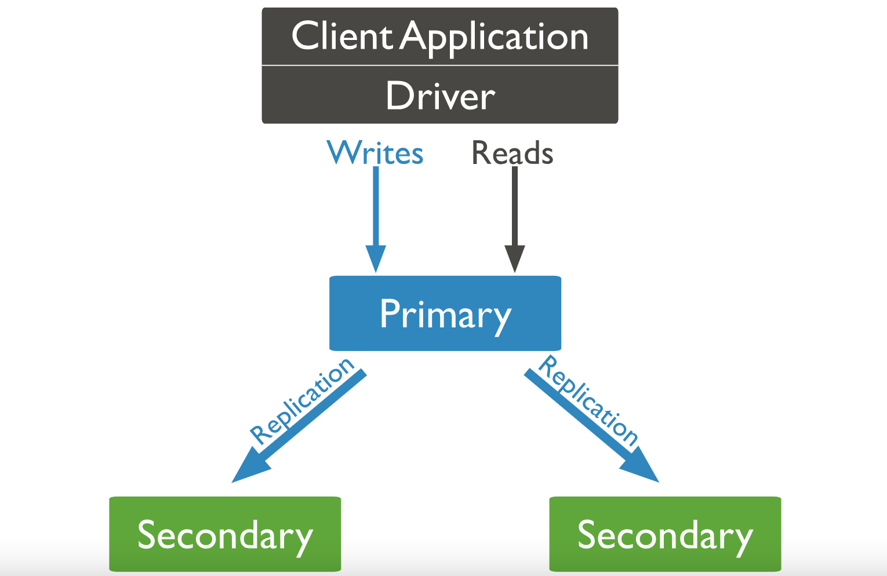

# Advanced Operations and Administration

- [MongoDB sorting and limiting explained](https://youtu.be/3mV2KMzNxLE?si=YVJ775Cvsc90Xpj8)
  - db.students.find()
  - db.students.find().sort({name: 1})
  - db.students.find().sort({name: -1})
  - db.students.find().sort({gpa: 1})
  - db.students.find().sort({gpa: -1})
  - db.students.find().limit(1) => return 1 decument
  - db.students.find().limit(3)
  - db.students.find().sort({gpa: -1}).limit(1)
  - db.students.find().sort({gpa: -1}).limit(3)

- [MongoDB indexes explained](https://youtu.be/ZoxmVjc4Xdg?si=5_5KnwqSFnUmhJyM)
  - db.students.createIndex({name: 1})
  - db.students.getIndexes()
  - db.students.dropIndex("name_1")

## MongoDB Replication

- replication: the process of creating redundant data to streamline and safeguard data availability and durability.
- Replication allows you to increase data availability by creating multiple copies of your data across servers.

- With MongoDB, replication is achieved through a replica set. Writer operations are sent to the primary server (node), which applies the operations across secondary servers, replicating the data.

- If the primary server fails (through a crash or system failure), one of the secondary servers takes over and becomes the new primary node via election. If that server comes back online, it becomes a secondary once it fully recovers, aiding the new primary node.
